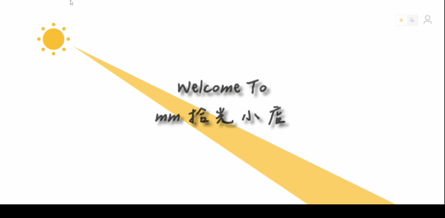

<div align="center">

<h1>MM-Account</h1>



</div>

<br>

mm-account 主要用于记账功能，打算做响应式布局，但现在说这话还太早，先把主要功能实现出来，目前仍处于快速迭代中！

目前门户主要用到的技术栈为 Vue3 + TypeScript + Vite

管理端打算复用 [mm-blog-manage](https://github.com/nanfeng1129/mm-blog-manage) 那一套，感觉没啥变化

后端之前一直用 NodeJS 写，但现在打算尝试下 SpringBoot + MybaticsPlus + Mysql (主要为技术尝试，学习ing)

<br>

## 项目开始

```bach
$ git clone https://github.com/nanfeng1129/mm-account.git
$ cd mm-account
$ npm install
$ npm run dev
```

<br>

## 感谢

* 暗黑模式的思路来源于 [TDesign](https://tdesign.tencent.com/)
* 首页字体为 [辰宇落雁體](https://github.com/Chenyu-otf/chenyuluoyan_thin)
